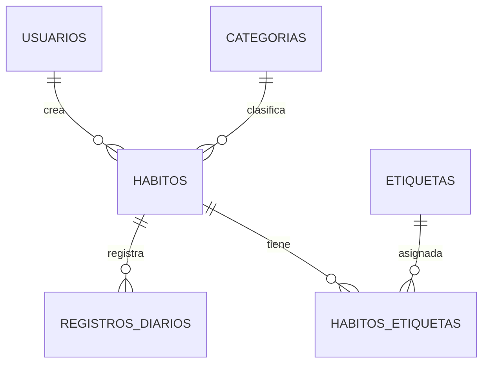

# Habit Tracker Web — Diseño de Base de Datos (Reto Final)

Proyecto de base de datos relacional para una aplicación web de **seguimiento de hábitos y metas diarias**.
Motor: **MySQL 8.0+ / InnoDB**. Entorno: IntelliJ IDEA.

---

## 1. Análisis de la industria y contexto operativo

### 1.1 Giro y propósito

El proyecto pertenece al sector de **productividad personal y salud digital** (self-tracking / wellness tech).
La organización opera una aplicación web cuyo propósito central es:

- Registrar la **constancia diaria** de hábitos de los usuarios.
- Evaluar **metas cuantitativas y cualitativas** (p. ej. 2 litros de agua, 30 min de estudio, hacer la tarea).
- Calcular automáticamente **rachas (streaks)** de días cumplidos.

### 1.2 Información que maneja la organización

| Tipo de dato | Descripción | Eje de negocio |
|---|---|---|
| Empleados/usuarios | nombre, apellido, correo, contraseña cifrada | Identifica a cada persona registrada |
| Catálogo de hábitos | nombre, descripción, tipo de meta, meta diaria, unidad de medida | Lo que el usuario decide seguir |
| Clasificaciones | categorías (Salud, Productividad, …) y etiquetas (prioridad, mañana, …) | Organiza y filtra los hábitos |
| Avance diario | fecha, cantidad alcanzada, si se cumplió la meta, nota | El corazón transaccional del sistema |
| Indicadores | rachas de días consecutivos | Motivación y reportes de adherencia |

### 1.3 Situación operativa actual (hojas de Excel)

En la operación manual la información se concentra en **libros de Excel** con una estructura así:

- **Hoja principal:** fila = hábito y 31 columnas `Día_01`…`Día_31` con valores booleanos (✓/✗) o métricas mixtas.
- **Hojas auxiliares:** catálogos de categorías y etiquetas, más una hoja con las metas por hábito.
- **Uso que se le da:** llevar el control del día a día y armar tablas dinámicas del mes.
- **Compartido con otras áreas:** los reportes se exportan a **PDF** y se envían por **correo** a mentores/coaches; también se comparten capturas instantáneas.

**Problemas identificados:** redundancia severa, celdas sin tipado estricto, fórmulas complejas que se rompen,
nula concurrencia multiusuario e imposibilidad de auditar cambios históricos.

### 1.4 Decisión de diseño

Convertir el modelo de hojas en una **base de datos relacional** donde *«cada día deja de ser una
columna y pasa a ser una fila»* en la tabla `registros_diarios`, lo que permite reportes por fecha,
categoría, cumplimiento y racha.

---

## 2. Diseño conceptual

### 2.1 Entidades y atributos

| Entidad | Tipo / Rol | Atributos | Restricción de integridad |
|---|---|---|---|
| `usuarios` | Catálogo maestro | `id_usuario`, `nombre`, `apellido`, `email`, `password_hash`, `fecha_registro` | `email` **único** |
| `categorias` | Catálogo | `id_categoria`, `nombre`, `descripcion`, `color_hex` | `nombre` **único**; color con formato `#RRGGBB` (CHECK) |
| `habitos` | Entidad fuerte | `id_habito`, `id_usuario (FK)`, `id_categoria (FK)`, `nombre`, `descripcion`, `tipo_meta`, `meta_diaria`, `unidad_medida`, `activo`, `fecha_creacion` | Si es `CUANTITATIVO`, meta y unidad obligatorias (CHECK) |
| `etiquetas` | Catálogo | `id_etiqueta`, `nombre` | `nombre` **único** |
| `habitos_etiquetas` | Tabla puente (N:M) | `id_habito (FK)`, `id_etiqueta (FK)` | **PK compuesta** `(id_habito, id_etiqueta)` |
| `registros_diarios` | Transaccional | `id_registro`, `id_habito (FK)`, `fecha`, `valor_completado`, `cumplido`, `nota`, `registrado_en` | **UNIQUE** `(id_habito, fecha)`; `valor >= 0` (CHECK) |

### 2.2 Relaciones y cardinalidad

| Relación | Cardinalidad | Explicación |
|---|---|---|
| `usuarios` → `habitos` | **1 : N** | Un usuario crea muchos hábitos; un hábito pertenece a un solo usuario |
| `categorias` → `habitos` | **1 : N** | Una categoría clasifica muchos hábitos; un hábito tiene una sola categoría |
| `habitos` → `registros_diarios` | **1 : N** | Un hábito acumula muchos registros diarios |
| `habitos` ↔ `etiquetas` | **N : M** | Un hábito lleva muchas etiquetas y una etiqueta se usa en muchos hábitos; se resuelve con `habitos_etiquetas` |

### 2.3 Restricciones de integridad

- **Integridad de dominio:** tipos estrictos (`DECIMAL`, `ENUM`, `DATE`, `BOOLEAN`), `CHECK` para color hexadecimal, meta de hábitos y valores no negativos.
- **Integridad de entidad:** PK `id_*` en todas las tablas; PK compuesta en la puente.
- **Integridad referencial:** FK con `ON DELETE CASCADE` en relaciones dependientes (`habitos_etiquetas`, `registros_diarios`) y `RESTRICT` en catálogos compartidos.
- **Unicidad de negocio:** `email` en usuarios; `nombre` en categorías y etiquetas; un registro por hábito y fecha.

---

## 3. Diagrama entidad-relación (con atributos)

### 3.1 Vista de conjunto (cardinalidades)

```
                     1:N                    N:M
  USUARIOS            HABITOS            ETIQUETAS
  (1) ─────────────< (N) >─────────────> (1)
                      │ 1                   (1)
                      │                     ▲
                      ▼                     │ N
             REGISTROS_DIARIOS        HABITOS_ETIQUETAS
                      (N)                  (puente N:M)
```

### 3.2 Diagrama detallado con atributos

```
+------------------------------+            +------------------------------+
|          usuarios            |            |          categorias          |
+------------------------------+            +------------------------------+
| id_usuario   (PK, AUTO_INC)  |            | id_categoria (PK, AUTO_INC)  |
| nombre       (VARCHAR   NOT) |            | nombre       (VARCHAR  UQ)   |
| apellido     (VARCHAR   NOT) |            | descripcion  (VARCHAR)       |
| email        (VARCHAR  UQ)   |            | color_hex    (CHAR     CK)   |
| password_hash(VARCHAR   NOT) |            +------------------------------+
| fecha_registro(TIMESTAMP)    |                         | 1
+------------------------------+                         |
        | 1                                                  |
        |                                                    |
  1:N   |  crea                                         1:N  |  clasifica
        |                                                    |
        v  N                                                 v
+------------------------------------------------------------------+
|                            habitos                              |
+------------------------------------------------------------------+
| id_habito    (PK, AUTO_INC)   id_categoria (FK → categorias)    |
| id_usuario   (FK → usuarios)  tipo_meta    (ENUM BOOLEANO/       |
| nombre       (VARCHAR   NOT)                   CUANTITATIVO)     |
| descripcion  (VARCHAR)        meta_diaria  (DECIMAL NULL)        |
| unidad_medida(VARCHAR NULL)   activo       (BOOLEAN  DEF TRUE)   |
| fecha_creacion(DATE     NOT)                                    |
+------------------------------------------------------------------+
        | 1                                         | 1
        |                                           |
        v  N                                        v  N  (puente N:M)
+------------------------------+            +------------------------------+
|      registros_diarios       |            |     habitos_etiquetas        |
+------------------------------+            +------------------------------+
| id_registro    (PK, AUTO)    |            | id_habito   (PK, FK)         |
| id_habito      (FK)          |            | id_etiqueta (PK, FK)         |
| fecha          (DATE    )    |            +------------------------------+
| valor_completado(DECIMAL)    |                        | N             | N
| cumplido       (BOOLEAN)     |                        v               v
| nota           (VARCHAR)     |            +------------------------------+
| registrado_en  (TIMESTAMP)   |            |          etiquetas           |
| UQ(id_habito, fecha)         |            +------------------------------+
+------------------------------+            | id_etiqueta (PK, AUTO_INC)  |
                                            | nombre       (VARCHAR  UQ)   |
                                            +------------------------------+
```

### 3.3 Diagrama Mermaid (M:N)



---

## 4. Procedimientos y funciones para pruebas de integridad y conectividad

Definidos en `database/schema.sql`.

| Rutina | Tipo | Propósito |
|---|---|---|
| `sp_test_conectividad()` | Procedimiento | Comprueba disponibilidad del servidor, sesión activa (`CURRENT_USER()`), zona horaria y timestamp del servidor. |
| `sp_registrar_habito_diario(id, fecha, valor, nota)` | Procedimiento | Registra o actualiza el avance diario de forma idempotente (`ON DUPLICATE KEY UPDATE`), validando la meta y calculando `cumplido`. Si el hábito no existe o está inactivo, lanza `SIGNAL`. |
| `fn_racha_habito(id_habito, fecha_hasta)` | Función | Devuelve la racha de días consecutivos cumplidos hacia atrás desde una fecha. Usa `MAX(cumplido)` porque un `SELECT…INTO` sin filas conserva el valor anterior y provocaría un bucle infinito si hay un día sin registro. |

### 4.1 Pruebas de conectividad

```sql
CALL sp_test_conectividad();
-- Esperado: estado 'Conectado a habit_tracker_db', sesión, zona horaria y timestamp actuales.

-- A nivel de aplicación: GET /api/health ejecuta SELECT 1 y responde 200 "MySQL conectado".
```

### 4.2 Pruebas de integridad

```sql
-- 1) Insertar un día nuevo (debe insertar y calcular cumplido = TRUE porque 2.0 >= 2.0).
CALL sp_registrar_habito_diario(1, '2026-08-29', 2.00, 'Prueba de integridad');

-- 2) Repetir la misma fecha (no debe duplicar; debe actualizar a valor 1.00, cumplido = FALSE).
CALL sp_registrar_habito_diario(1, '2026-08-29', 1.00, 'Actualización');

-- 3) Hábito inexistente (debe lanzar error SQLSTATE 45000).
CALL sp_registrar_habito_diario(9999, '2026-08-29', 1.00, NULL);

-- 4) Racha consecutiva de un hábito.
SELECT fn_racha_habito(1, '2026-08-28');

-- 5) No deben existir valores negativos.
SELECT COUNT(*) AS negativos FROM registros_diarios WHERE valor_completado < 0; -- esperado 0

-- 6) No deben existir emails repetidos ni habito-fecha duplicados.
SELECT COUNT(*) AS emails_duplicados FROM usuarios GROUP BY email HAVING COUNT(*) > 1;
SELECT COUNT(*) AS duplicados FROM registros_diarios GROUP BY id_habito, fecha HAVING COUNT(*) > 1;

-- 7) Racha con un día sin registro: la función debe cortar la racha y NO desbordarse
--    a fechas inválidas (el caso del hueco que motivó usar MAX(cumplido)).
SELECT fn_racha_habito(1, CURDATE());
```

### 4.3 Vista de administración (reportes)

`usuarios.es_admin = TRUE` habilita la vista `Admin` de la aplicación, alimentada por `GET /api/admin`.
Sus consultas aprovechan agregados y las rutinas ya definidas: totales globales (subconsultas), actividad
diaria de los últimos 14 días (`GROUP BY fecha`), ranking de hábitos por categoría (`LEFT JOIN` + conteo)
y una tabla por usuario que combina `AVG(cumplido)`, racha (`fn_racha_habito`) y últimas fechas.

---

## 5. Diseño lógico, llaves y normalización

### 5.1 Llaves primarias y foráneas

| Tabla | Llave primaria | Llaves foráneas |
|---|---|---|
| `usuarios` | `id_usuario` | — |
| `categorias` | `id_categoria` | — |
| `habitos` | `id_habito` | `id_usuario → usuarios`, `id_categoria → categorias` |
| `etiquetas` | `id_etiqueta` | — |
| `habitos_etiquetas` | `(id_habito, id_etiqueta)` | `id_habito → habitos`, `id_etiqueta → etiquetas` |
| `registros_diarios` | `id_registro` | `id_habito → habitos` |

Los tipos de dato, restricciones `UNIQUE`, `CHECK` y valores por defecto de cada campo están en
[diccionario_de_datos.md](diccionario_de_datos.md).

### 5.2 Aplicación de las tres primeras formas normales

- **1FN (atomicidad):** todos los atributos son atómicos (un valor por campo). Los días del mes dejaron
  de ser columnas (`Día_01`…) y cada día es una **fila** en `registros_diarios`. La puente `habitos_etiquetas`
  solo guarda pares dentro de la PK compuesta.
- **2FN (sin dependencias parciales):** las tablas tienen PK de un solo atributo (o ninguna en la puente),
  por lo que es imposible que un campo no clave dependa de una parte de la llave.
- **3FN (sin dependencias transitivas):** las clasificaciones se desacoplan en catálogos: `categorias`
  (nombre, color) y `etiquetas` (nombre) no viven dentro de `habitos`; tampoco se guardan campos derivados
  como la racha, que se **calcula** con `fn_racha_habito()`.

---

## 6. Scripts de despliegue

| Archivo | Contenido |
|---|---|
| `database/schema.sql` | DDL: 6 tablas, índices, PK/FK, CHECK, procedimientos y función. |
| `database/seed.sql` | Datos de muestra: 5 usuarios, 5 categorías, 6 hábitos, 5 etiquetas, 10 relaciones M:N y 15 registros diarios. |
| `docs/diccionario_de_datos.md` | Tipos de dato, PK/FK y reglas de cada campo. |